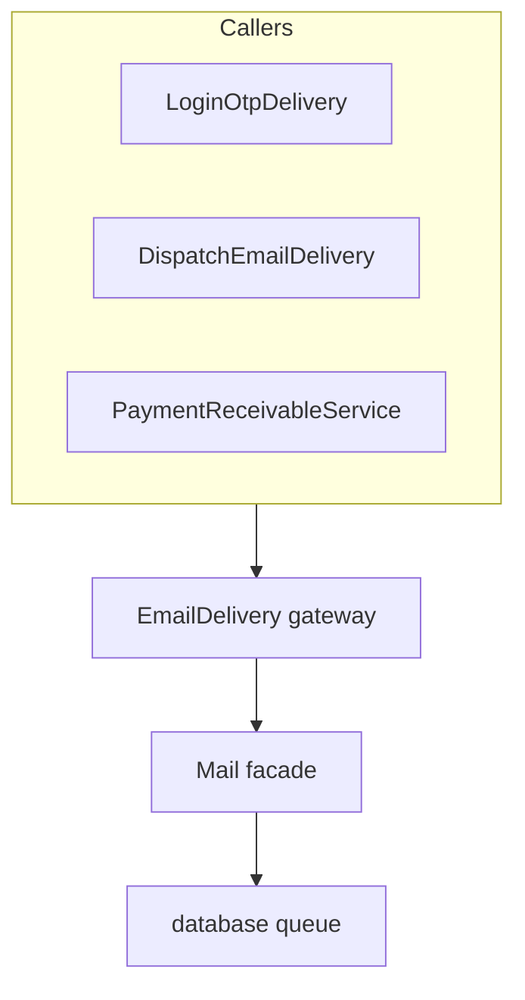

# Email Module — Requirements & Implementation Reference
> Laravel 12 | Queued mail | ERP-branded templates | Prepared for AI-assisted code generation

---

## 📁 Module Overview

**Module Name:** Email (cross-cutting)
**Framework:** Laravel 12
**Layout:** `resources/views/emails/layouts/app.blade.php` (cream wrapper `#fffce3`)
**Queue:** `ShouldQueue` on all mailables; `QUEUE_CONNECTION=database`; worker scheduled in `bootstrap/app.php`

**Purpose:** Centralize all outbound email through one gateway (`EmailDelivery`), with domain-specific delivery helpers for recipient resolution and payload building. Templates use ERP brand colors aligned with `public/assets/css/style.css`.

**Convention:** Do **not** import `Illuminate\Support\Facades\Mail` outside `app/Support/EmailDelivery.php`. New features: create mailable → call `EmailDelivery::queue()` or `::send()` via a thin `*Delivery` helper.

---

## 📅 Changelog — 17 Jun 2026 (Late-fee payment pending reminder emails)

### Summary
When the nightly late-fee accrual job posts a new daily charge for a dispatch, a **Payment pending** reminder email is queued to the dealer and company.

### Trigger
- Command: `payment:accrue-late-fees` (scheduled daily at `00:00` in `bootstrap/app.php`)
- Service: `PaymentReceivableService::accrueDispatch()` — email sent only when `days_accrued > 0` for that run
- Late-fee-only DB updates do **not** trigger the dispatch payment-status-changed email (observer unchanged)

### Recipients

| Role | Source | Mail role |
|---|---|---|
| Dealer | `order.dealer.user.email` | **To** |
| Company | `getSetting('company_email')` | **CC** |

Edge cases:
- No dealer email → **To** company only; skip if company email also invalid
- Dealer and company same address → single **To**, no duplicate CC

### Files

| Layer | Path |
|---|---|
| Mailable | `app/Mail/DispatchPaymentPendingReminderMail.php` |
| Delivery | `app/Support/DispatchEmailDelivery.php` — `queuePaymentPendingReminder()` |
| Presenter | `app/Support/DispatchEmailPresenter.php` — `forPaymentPendingReminder()` |
| Hook | `app/Services/PaymentReceivableService.php` — after successful accrual |
| Views | `resources/views/emails/dispatch/payment_pending_reminder.blade.php`, `partials/payment-pending-callout.blade.php` |

### Subject
`Payment pending — {unique_order_id}`

---

## 📅 Changelog — 17 Jun 2026 (Common email send gateway)

### Summary
All outbound mail routes through `App\Support\EmailDelivery` with `queue()` (async) and `send()` (sync) methods.

### API

```php
EmailDelivery::queue(string|array $to, Mailable $mailable, array $cc = [], array $bcc = []): bool
EmailDelivery::send(string|array $to, Mailable $mailable, array $cc = [], array $bcc = []): bool
```

### Responsibilities
1. Normalize recipients — trim, validate email, dedupe, lowercase
2. Skip silently (return `false`, log info) when no valid **To** addresses
3. Build `Mail::to()` → optional `cc()` / `bcc()` → `queue()` or `send()`

### Refactored callers
- `app/Support/LoginOtpDelivery.php` — OTP login
- `app/Support/DispatchEmailDelivery.php` — dispatch notifications

---

## 📅 Changelog — 17 Jun 2026 (Dispatch dealer email notifications)

### Summary
Dealers receive automated emails when a dispatch is created or when dispatch payment status / partial amount changes. Triggered via model observer — **no controller changes**.

### Trigger rules (`DispatchManagementObserver`)

| Event | Condition | Email |
|---|---|---|
| `created` | Always (if dealer has email) | Dispatch recorded |
| `updated` | `status` or `partial_paid_amount` changed | Dispatch payment updated |
| `updated` | Only `accrued_late_fee` / `late_fee_last_accrued_on` changed | **No email** (separate late-fee reminder) |

### Recipient
- `order.dealer.user.email` — skip if null/empty (phone-only dealers)

### Mailables

| Mailable | Subject | View |
|---|---|---|
| `DispatchCreatedMail` | `Dispatch recorded — {order_id}` | `emails.dispatch.created` |
| `DispatchPaymentStatusChangedMail` | `Dispatch payment updated — {order_id}` | `emails.dispatch.payment_status_changed` |

### Payload
- `DispatchEmailPresenter::forDispatch()` — order, **single linked line item** (not full order), dispatch, receivable summary via `PaymentReceivableService`
- Payment-changed email includes `previous_payment_status` / `previous_partial_paid_amount` extras

### Files

| Layer | Path |
|---|---|
| Observer | `app/Observers/DispatchManagementObserver.php` |
| Delivery | `app/Support/DispatchEmailDelivery.php` |
| Presenter | `app/Support/DispatchEmailPresenter.php` |
| Registration | `app/Providers/AppServiceProvider.php` — `DispatchManagement::observe(...)` |
| Views | `resources/views/emails/dispatch/` (+ `partials/`) |

---

## 📅 Changelog — 17 Jun 2026 (ERP-aligned email brand colors)

### Summary
Email templates use centralized ERP color tokens instead of generic palette.

| Layer | Path |
|---|---|
| PHP tokens | `app/Support/EmailBrandTheme.php` — `colors()`, `badgeStyles()` |
| Blade helper | `resources/views/emails/partials/brand-styles.blade.php` |
| Primary | `#014e9c` |
| Text | `#262A2A` / muted `#6F6F6F` |
| Badges | Match CRM — Paid `#D3FFD3`/`#5CB85C`, Partial `#FFEECD`/`#FDA700`, Unpaid `#FFEEEC`/`#014e9c` |

**Note:** Parent views must set `$brand` via `@php($brand = \App\Support\EmailBrandTheme::colors())` — `@include` of brand-styles alone does not export `$brand` to parent scope.

---

## 🏗️ Architecture

```text
Domain event / cron
    → *Delivery helper (recipients + payload)
        → EmailDelivery::queue() | ::send()
            → Laravel Mail facade
                → Queued Mailable (ShouldQueue)
                    → Blade view (emails.layouts.app)
```



---

## 📧 Implemented email types

| Type | Delivery helper | Mailable | Recipients |
|---|---|---|---|
| Login OTP | `LoginOtpDelivery::queue()` | `LoginOtpMail` | User email + fixed admin copies |
| Dispatch created | `DispatchEmailDelivery::queueCreated()` | `DispatchCreatedMail` | Dealer |
| Dispatch payment updated | `DispatchEmailDelivery::queuePaymentChanged()` | `DispatchPaymentStatusChangedMail` | Dealer |
| Late-fee payment reminder | `DispatchEmailDelivery::queuePaymentPendingReminder()` | `DispatchPaymentPendingReminderMail` | Dealer To, company CC |

---

## 📂 File reference

### Support / delivery

| File | Role |
|---|---|
| `app/Support/EmailDelivery.php` | **Single Mail facade entry point** |
| `app/Support/EmailBrandTheme.php` | ERP color tokens and badge styles |
| `app/Support/LoginOtpDelivery.php` | OTP recipient list + queue |
| `app/Support/DispatchEmailDelivery.php` | Dispatch dealer/company recipients + queue |
| `app/Support/DispatchEmailPresenter.php` | Email payload builder |

### Mailables (`app/Mail/`)

| File | Implements |
|---|---|
| `LoginOtpMail.php` | `ShouldQueue` |
| `DispatchCreatedMail.php` | `ShouldQueue` |
| `DispatchPaymentStatusChangedMail.php` | `ShouldQueue` |
| `DispatchPaymentPendingReminderMail.php` | `ShouldQueue` |

### Views (`resources/views/emails/`)

| Path | Purpose |
|---|---|
| `layouts/app.blade.php` | Master email layout |
| `login_otp.blade.php` | OTP code email |
| `dispatch/created.blade.php` | New dispatch notification |
| `dispatch/payment_status_changed.blade.php` | Payment status change |
| `dispatch/payment_pending_reminder.blade.php` | Late-fee accrual reminder |
| `dispatch/partials/details.blade.php` | Order / line item / dispatch / receivable cards |
| `dispatch/partials/section-card.blade.php` | Card wrapper |
| `dispatch/partials/detail-row.blade.php` | Label/value rows |
| `dispatch/partials/status-badge.blade.php` | Status pills |
| `dispatch/partials/payment-change-callout.blade.php` | Previous payment highlight |
| `dispatch/partials/payment-pending-callout.blade.php` | Overdue days, fee added today, balance due |
| `partials/brand-styles.blade.php` | Brand CSS variables include |

---

## ⚙️ Queue & scheduler

| Item | Configuration |
|---|---|
| Queue connection | `.env` → `QUEUE_CONNECTION=database` |
| Queue worker | `bootstrap/app.php` — `queue:work database --stop-when-empty --max-time=55` every minute |
| Late-fee accrual | `bootstrap/app.php` — `payment:accrue-late-fees` daily at `00:00` |
| Command | `app/Console/Commands/AccrueDispatchLateFeesCommand.php` |

**Manual run:** `php artisan payment:accrue-late-fees`

---

## ⚙️ General settings used by email

| Key | Usage |
|---|---|
| `company_email` | CC on late-fee payment pending reminders |
| `payment_due_days` | Late-fee grace period (accrual eligibility) |
| `payment_due_amount` | Daily late-fee rate per bag (accrual amount) |

Configured in **General Settings** (`GeneralSettingController`, `getSetting()` helper).

---

## 📋 Adding a new email (checklist)

1. Create `app/Mail/YourMailable.php` implementing `ShouldQueue` (if async).
2. Create Blade view under `resources/views/emails/` extending `emails.layouts.app`.
3. Set `$brand` via `EmailBrandTheme::colors()` in the view.
4. Add thin `app/Support/YourEmailDelivery.php` (or extend existing helper) for recipient logic.
5. Call `EmailDelivery::queue()` or `::send()` — never `Mail::` directly.
6. Document in this file under **Implemented email types**.

---

## 🔗 Related modules

| Module | Document |
|---|---|
| Sales / Dispatch | `md-file-requirements/Sales_Module_Requirements.md` |
| Dispatch Pending Payments / late fees | `md-file-requirements/Dispatch_Pending_Payments_Module_Requirements.md` |
| Dashboard / OTP login | `md-file-requirements/Dashboard_Module_Requirements.md` |
| General settings (`company_email`) | `resources/views/generalsetting/create.blade.php` |

---

## ✅ Verification checklist

1. Queue worker running (`php artisan queue:work` or scheduler).
2. Dealer user has valid email for dispatch notifications.
3. `company_email` set in General Settings for late-fee reminder CC.
4. Dispatch create → “Dispatch recorded” email queued.
5. Payment status / partial amount change → “Dispatch payment updated” email queued.
6. Late-fee cron with new accrual → “Payment pending” email queued (dealer To, company CC).
7. Late-fee-only update → no payment-status-changed email.
